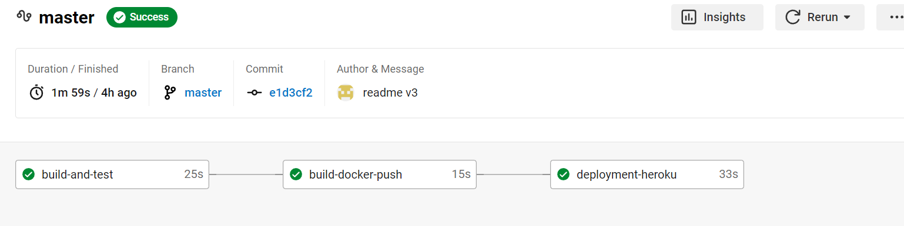
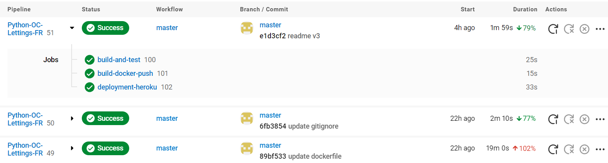

  

 

  

  

  
 
  

---
## Accès rapide

#### - [Développement local](#heading--1)
#### - [Déploiement](#heading--2)

---

## Livrable du P13 OC DA-Pyton :  
**Mettez à l'échelle une application Django en utilisant une architecture modulaire**
### Introduction et objectifs
Orange County Lettings est une start-up fictive dans le secteur de la location de biens immobiliers.
La société étant en croissance, elle doit faire évoluer son site web éxistant (repository GitHub : [OC Lettings](https://github.com/OpenClassrooms-Student-Center/Python-OC-Lettings-FR)) sur quatre points :
- Réduction de diverses dettes techniques sur le projet 
- Refonte de l'architecture modulaire 
- Ajout d'un pipeline CI/CD utilisant CircleCI et Heroku 
- Surveillance de l’application et suivi des erreurs via Sentry.

  

## Développement local

### Prérequis

- Compte GitHub avec accès en lecture à ce repository
- Git CLI
- SQLite3 CLI
- Interpréteur Python, version 3.6 ou supérieure

Dans le reste de la documentation sur le développement local, il est supposé que la commande `python` de votre OS shell exécute l'interpréteur Python ci-dessus (à moins qu'un environnement virtuel ne soit activé).

### macOS / Linux

#### Cloner le repository

- `cd /path/to/put/project/in`
- `git clone https://github.com/OpenClassrooms-Student-Center/Python-OC-Lettings-FR.git`

#### Créer l'environnement virtuel

- `cd /path/to/Python-OC-Lettings-FR`
- `python -m venv venv`
- `apt-get install python3-venv` (Si l'étape précédente comporte des erreurs avec un paquet non trouvé sur Ubuntu)
- Activer l'environnement `source venv/bin/activate`
- Confirmer que la commande `python` exécute l'interpréteur Python dans l'environnement virtuel
`which python`
- Confirmer que la version de l'interpréteur Python est la version 3.6 ou supérieure `python --version`
- Confirmer que la commande `pip` exécute l'exécutable pip dans l'environnement virtuel, `which pip`
- Pour désactiver l'environnement, `deactivate`

#### Exécuter le site

- `cd /path/to/Python-OC-Lettings-FR`
- `source venv/bin/activate`
- `pip install --requirement requirements.txt`
- `python manage.py runserver`
- Aller sur `http://localhost:8000` dans un navigateur.
- Confirmer que le site fonctionne et qu'il est possible de naviguer (vous devriez voir plusieurs profils et locations).

#### Linting

- `cd /path/to/Python-OC-Lettings-FR`
- `source venv/bin/activate`
- `flake8`

#### Tests unitaires

- `cd /path/to/Python-OC-Lettings-FR`
- `source venv/bin/activate`
- `pytest`

#### Base de données

- `cd /path/to/Python-OC-Lettings-FR`
- Ouvrir une session shell `sqlite3`
- Se connecter à la base de données `.open oc-lettings-site.sqlite3`
- Afficher les tables dans la base de données `.tables`
- Afficher les colonnes dans le tableau des profils, `pragma table_info(Python-OC-Lettings-FR_profile);`
- Lancer une requête sur la table des profils, `select user_id, favorite_city from
  Python-OC-Lettings-FR_profile where favorite_city like 'B%';`
- `.quit` pour quitter

#### Panel d'administration

- Aller sur `http://localhost:8000/admin`
- Connectez-vous avec l'utilisateur `admin`, mot de passe `Abc1234!`

### Windows

Utilisation de PowerShell, comme ci-dessus sauf :

- Pour activer l'environnement virtuel, `.\venv\Scripts\Activate.ps1` 
- Remplacer `which <my-command>` par `(Get-Command <my-command>).Path`  

  

## Déploiement

### Prérequis
- Un compte Github
- Un compte CircleCi
- Un compte DockerHub
- Un compte Heroku
- Un compte Sentry

### Principe de fonctionnement du pipeline CircleCi

Cette gestion est codifiée dans le fichier config.yml du projet.

#### Push sur une branche autre que master

Seul le job `build-and-test` s'exécute avec les actions suivantes :
  - Run Tests : exécution de tests unitaires via la commande pytest
  - Run Linting : exécution du linting via la commande flake8
    
#### Push sur la branche master

Trois jobs peuvent s'exécuter :
- `build-and-test` 
- `build-docker-push` est lancé seulement si `build-and-test` s'est terminé correctement avec les étapes suivantes :
  - Build Docker image : création d'une image docker à partir du code source de l'application.
  - Push Docker Image : Chargement de l'image vers le Docker Hub avec deux tags : l'un correspondant au 'hash' de commit CircleCI et l'autre avec le tag 'latest'".
- `deployment-heroku` est lancé seulement si `build-docker-push` est un succès et exécute l'action suivante :
  - Start container and push to Heroku : lancement du build de l'application sur Heroku via Git

### Définition des variables d'environnement :

Il est nécessaire de définir des variables d'environnement (dans CircleCi) pour le fonctionnement du déploiement :

| Nom des variables | Description                              |
|-------------------|------------------------------------------|
| `DOCKER_REPO`     | Nom de votre repository Docker           |
| `DOCKER_USERNAME` | Nom d'utilisateur de votre compte Docker |
| `DOCKER_TOKEN`    | Token de votre compte Docker             |
| `HEROKU_API_KEY`  | Clé API de votre compte Heroku           |
| `HEROKU_APP_NAME` | Nom de l'application Heroku              |
| `SECRET_KEY`      | Clé secrete Django                       |
| `SENTRY_DSN`      | Token interne d'intégration Sentry       |

Il faut également définir un fichier .env à la racine de votre projet avec les variables suivantes :

| Nom des variables | Description                              |
|-------------------|------------------------------------------|
| `SECRET_KEY`      | Clé secrete Django                       |
| `SENTRY_DSN`      | Token interne d'intégration Sentry       |

### Exécution du déploiement
Après avoir réalisé un commit push, vous pouvez suivre les étapes du workflows sur CircleCi :  

  

  

  

 
Vous pouvez ensuite exécuter l'application à partir d'une image locale (avec Docker) ou directement sur Heroku  

#### Docker :  
Depuis votre terminal, tapez les 2 commandes suivantes :
- `docker pull cyl94700/python-oc-lettings-fr:latest  `
- `docker run -p 8000:8000 cyl94700/python-oc-lettings-fr:latest `  

Ces commandes permettent la récupération et l'accès à la dernière image créée, mais vous pouvez utiliser une image antérieure en utilisant le "hash" du commit CircleCi correspondant au lieu du terme "latest".

Puis, depuis votre navigateur, rendez-vous sur :  

- http://localhost:8000/

#### Heroku
Rendez-vous à l'adresse suivante :  

https://python-oc-lettings-cyl94700.herokuapp.com/  
#### Sentry
